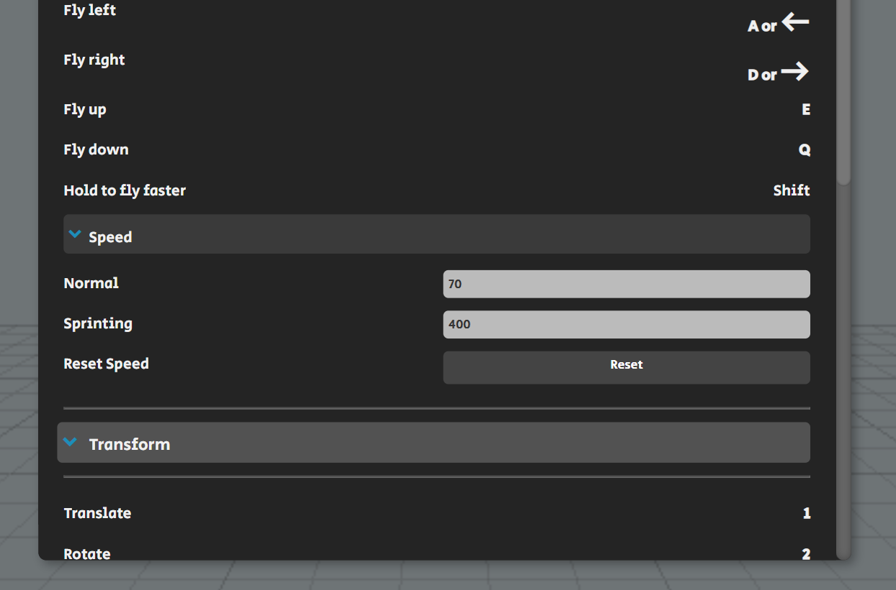
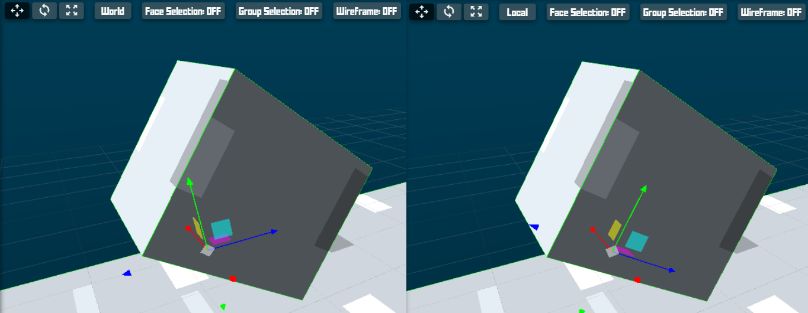
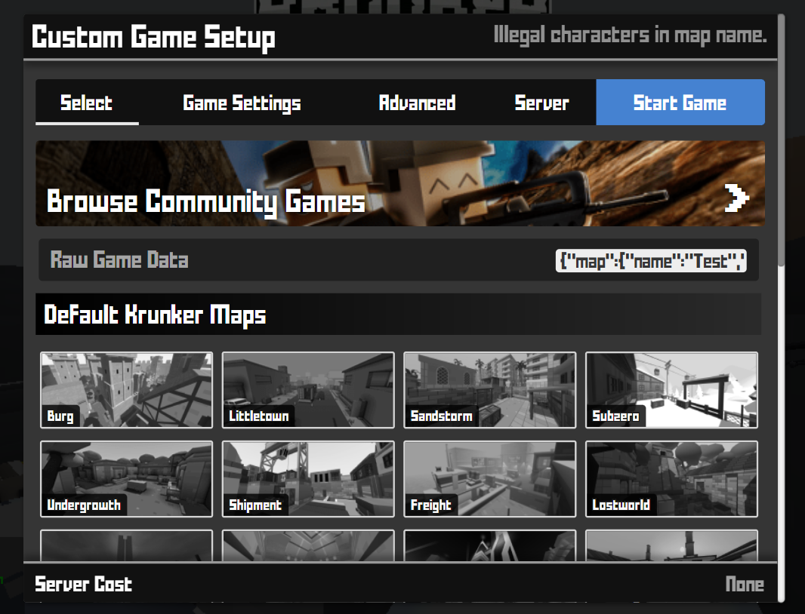
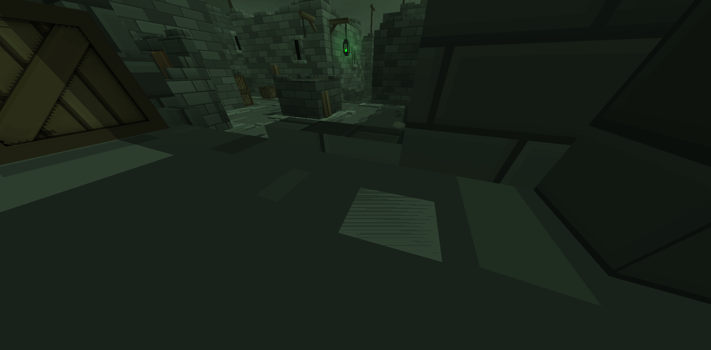
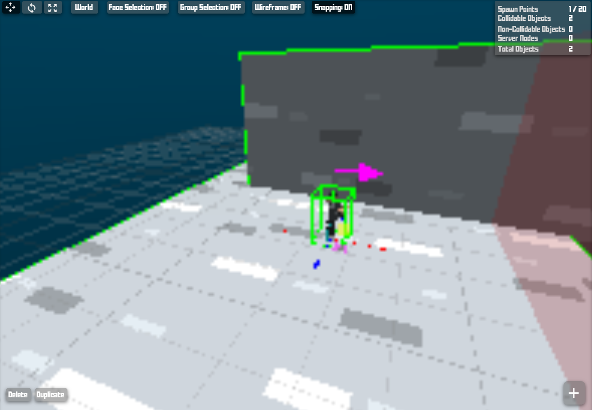
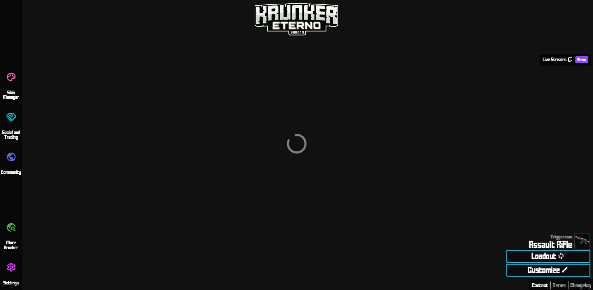

# 1.0.0 General info & FAQ
## 1.1.0 Editor hotkeys
**NOTE:** These hotkeys can be re-bound to more convenient keys. We recommend being judicious about this, as heavily modified key binds can lead to confusion on the user end.
### 1.1.1 Basic movement
**NOTE:** These movement controls are relative to the camera's direction.
- *Forward:* `W` or `UP` or `scroll up`
- *Backward:* `S` or `DOWN` or `scroll down`
- *Left:* `A` or `LEFT`
- *Right:* `D` or `RIGHT`
- *Up:* `E`
- *Down:* `Q`
- *Sprint:* `Shift`
### 1.1.2 Transform
- *Translate:* `1`
- *Rotate:* `2`
- *Scale:* `3`
- *Toggle world / local space:* `Á` (See 1.3.11)
### 1.1.3 Edit
- *Undo:* `CTRL + Z`
- *Redo:* `CTRL + Y` or `Shift + Ctrl + Z
### 1.1.4 Object
- *Face selection mode:* `M`
- *Group selection mode:* `N`
- *Wireframe mode:* `¼`
- *Delete element:* `Del` or `Backspace`
- *Toggle snapping:* `CTRL`
- *Toggle collidable:* `Shift + C`
- *Toggle visibility:* `Shift + V`
### 1.1.5 Object (advanced)
**NOTE:** Those about object *creation* will **create near** the camera regardless of whether the  *create near* setting is enabled.
- *Open texture / model list:* `T` (must have object selected)
- *Open scripting window:* `0`
- *Create placeholder:* `P`
- *Create cube:* `C`
- *Create gate:* `G`
- *Create trigger:* `R`
- *Hitbox fixer:* `Shift + F` (only works on a select few official assets, like cars; see 1.3.14)
- *Flip x / z size:* `F`
- *Quick add:* `X` (opens a selection menu)
* Quick object menu: `Scroll wheel click`
### 1.1.6 Group
- *Remove all groups:* `Shift + Alt + G`
- *Create group / Remove group if exist:* `Shift + G`
- *Duplicate group / object:* `Shift + R`
- *Copy group:* `Ctrl + C`
- *Paste group:* `Ctrl + V`
### 1.1.7 File
- *Paste preset JSON:* `Shift + Click` (w/ Objectpainter)
## 1.2.0 Map publishing limitations
### 1.2.1 Object limits
- *Collidable object limit:* 4,500 (6,000 for premium/verified users)
- *Overall object limit:* 5,000 (7,500 for premium/verified users)
- *Game data limit (export file):* 500,000 characters/500 KB
### 1.2.2 Game/map limits
- *Map name:* 16 characters
- *Spawn point limit:* 20
- *Sign limit:* 100
- *AI limit:* 40
- *GUI element limit:* 40 (80 for verified users)
- *Welcome message:* 70 characters (including spaces)
- *Key/data name values:* 10 characters
### 1.2.3 Thumbnail sizes (.png and .apng format)
- *Standard:* 250 KB
- *Premium:* 500 KB
- *Dimensions:*: 220x100 px, or an aspect ratio of 11:5
## 1.3.0 FAQ
### 1.3.1 I switched tabs, then switched back, and now I can't see any of my map.
Two approaches can generally resolve this problem: a) press the **navigate** button and enter a point near your creation (best practice is to keep it around the origin; (0,0,0)) or b) go to **Object > Scene Graph** and select objects until you arrive at a desirable location. A good rule of thumb for finding specific places with **Scene Graph** is to look for unique objects, like specific model types, spawn points, or checkpoints.
### 1.3.2 I'm working far away from the origin, and every time I create an object it is hard to get over where I am.
**Edit > Settings > Object** and switch the **Create Near** option on. This will create each new object at your current location.
### 1.3.3 The map I'm editing is very large, and the sprint speed is unbearably slow.
**Help > Controls > Movement > Speed** and set **Sprinting** to a higher value. A value of 300-400 will be sufficient for most large maps.

### 1.3.4 Why can I walk through a wall and/or why is there an invisible wall when I didn't put one there?
This is a common symptom of the *rotation of collidable objects*. For beginners, we strongly recommend avoiding rotation of any object the player will interact with. By default, the game does not consider the rotation when calculating collisions, so the real collision volume will be the unrotated object. 

Many new mapmakers resort to rotation to simply swap the x and z scale parameters. This can be accomplished more quickly (and without issues) by pressing **F** while focused on an object. If you like to rotate things for decoration, it is prudent to enable the setting **Show Real Hitbox** under **Edit > Settings > Game**. If you must have a rotated collision (this is most tolerable for walls), you may choose to enable **complex collisions**.
### 1.3.5 Why don't complex collisions work as expected? Why can't I slidehop on them? Why do I slip off?
Complex collisions use a pill-shaped collision box for the player, and weren't tuned to fit within Krunker's physics style. Avoid use where this variation poses a risk to gameplay. They generally work acceptably with walls. They also consume your limited file size very quickly, as every triangle is explicitly defined, even for primitives like cubes.
### 1.3.6 How can I get started making maps?
The best thing to do is to go to https://krunker.io/editor.html now, and start messing with the editor. Like many other skills, immersion is a great way to get started. The editor is graphical, fairly intuitive, and limited enough in scale (as opposed to a large program like Blender) that most practical things will be fairly apparent. Make use of provided video tutorials. 

If you have a specific question, we're here to help. Before you ask, always feel free to check the FAQ (that's this!) and other user guides. Don't be too focused on making one particular thing at first, most map types require a general knowledge of the editor that is developed over time. To get a sense of what can be done, and the methods to make them, make use of the templates by going to **Help > Guide > Templates**.
### 1.3.7 How can I save and/or load my map?
**File > Save Project** and **File > Import Project** can save and load map files. The save option saves a text file (in the form of a JSON object) to your computer. Be sure to use "save as" and title it with something sensible when prompted. Export files may also be used. These are more compact and crucially *do not preserve* editor-specific information that would not have an effect on map publishing. Among other things, this includes groups and camera location. Map importation requires that you copy either the save or export text into the import window. It may stutter a bit if the map is large.
### 1.3.8 When should I save my map? When should I export my map?
As mentioned previously (in 1.3.7), saving preserves certain editor-unique features like camera position and grouping. Exportation is required for publishing a map from the map file. If a user pastes a save file in the publishing field, an error will be thrown and the map will not be published. Additionally, a similar error will be thrown if a user attempts to host a map from a save file.
### 1.3.9 What are borders?
Borders are barriers that can be applied to cubes. They extend 500 units above the cube's top side, and allow bullets, but not players, through. They are useful for preventing unwanted player access to odd places, and are extensively used in rotation (pub) maps. Be mindful that 500 units is not infinite and if you have differently-leveled borders, or other structures nearby, players can make their way over the borders. Borders do not rotate with normal object rotation, and complex collision usage will disable the border altogether.
### 1.3.10 How do I group objects?
Grouping can be done in two primary ways:
1. Create an object, like a placeholder (by pressing **P**). Then, stretch it over all objects you want to group. Then press **Shift + G** to create the group object. This is the optimal strategy for selecting a large quantity of objects, but highly inadequate if you need to select objects packed tightly among many other objects.
2. Press **N** to turn on **Group Selection Mode**. Select objects by clicking on them. Once you are done selecting, press **N** again, and an object will be created. This is most useful for grouping a small number of objects, or objects that are interspersed with ones you do not want to group.
### 1.3.11 What is "world" and "local" space?
These settings determine the coordinate system used for transformations. In world space, moving an object up will strictly increase its Y-value relative to the scene, regardless of the object's orientation. Conversely, in local space, transformations occur along the object’s own rotated axes. While terminology varies across 3D software, **world** and **local** are functionally identical to "global" and "object" space. 

This visual explanation is helpful:

### 1.3.12 What is the "create near" option?
When a user creates an object from the object creation menu in the toolbar, it will appear at the camera's location. When this setting is off, each object will be created at the origin, which can be inconvenient.
### 1.3.14 Why didn't "fix hitbox" work on my broken hitbox?
"Fix hitbox" only works on select models, like cars. Full list pending. All it does is create some invisible 

### 1.3.15 Where can I get the player models?
There are no player models. The models are made up of Three.js cuboids.

### 1.3.16 Why are inputted angles not working as expected?
Angles are in radians by default. 180 degrees is 3.14, 90 is 1.57, etc. This isn't very intuitive, so it is a good idea turn on "anti-radians" which makes the editor recognize degrees. Keep in mind, rounding is still done according to radians, so the rounding may be odd (like 90 rounding to 89.95).

### 1.3.17 Can I exceed the limits imposed by the editor on range inputs?
Yes, you can, for some things. This requires modifying the JSON file. See section 10.

### 1.3.18 Why am I getting "Invalid map format" or "Illegal characters in map name" errors when trying to host my map?
Look at the start of the file. If it starts with `{"map":{"name":`, you tried to use the save file. The save file **cannot be used to host maps**. Use the export file instead. See 1.3.8.

### 1.3.19 What is Z-fighting?
Z-fighting is a graphical glitch where two objects have the same depth value in the Z-buffer, particularly when two faces with a different texture or color overlap. It produces a fragmented zig-zag pattern. This can be irritating and even uncomfortable to look at. It is important to note that at large distances, Z-fighting may occur for faces that are not overlapping (but close), so move them out by larger distances for very large maps. As an example, in the classic map [bhop_Ravine](https://krunker.io/social.html?p=map&q=bhop_Ravine), things start breaking down visually when you reach the highest levels.

Z-fighting is a difficult visual glitch to hunt down, and it even appears in longstanding rotation maps, like Citadel.

### 1.3.20 I have my resolution set high, why is my resolution in reality so low?
This is often caused by accidental zooming. If a user decreases page zoom, the GUI will hardly change, whereas the viewscreen will have a very low resolution and the gizmos will be the wrong size. The resolution can be resolved by fixing your page zoom, but you may need to copy your map file, refresh, and re-import to resolve the gizmo size changes. Be mindful that `CTRL + 0` opens up the scripting window, so use `CTRL + +` and `CTRL + -`.

### 1.3.21 Why is the sandbox/test game feature continuously loading?
This is frequently caused by having no *collidable* objects in the map with **Show On Minimap** enabled. Resolve it by enabling both of these, in at least one cube.

### 1.3.22 Why is server-side KrunkScript not working in sandbox/test game?
Only client-side KrunkScript is run in the sandbox. Host the game instead to test server-side code.

### 1.3.23 I closed my tab/my computer crashed and I lost my progress. What do I do?
Fortunately, Krunker's editor has a backup feature. One close and refresh, the editor saves the map file to your browser. If you edit on an Incognito tab or if you clear browser data, you will lose these files. Access them from **File > Load Backup**.

