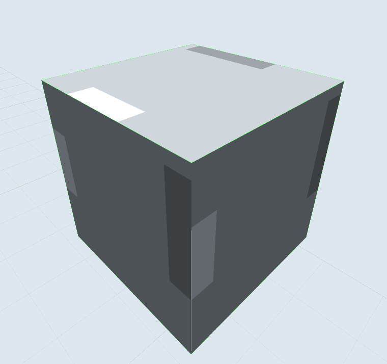
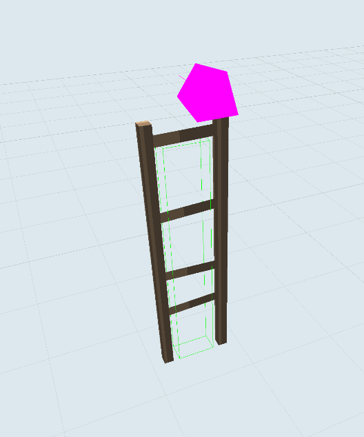
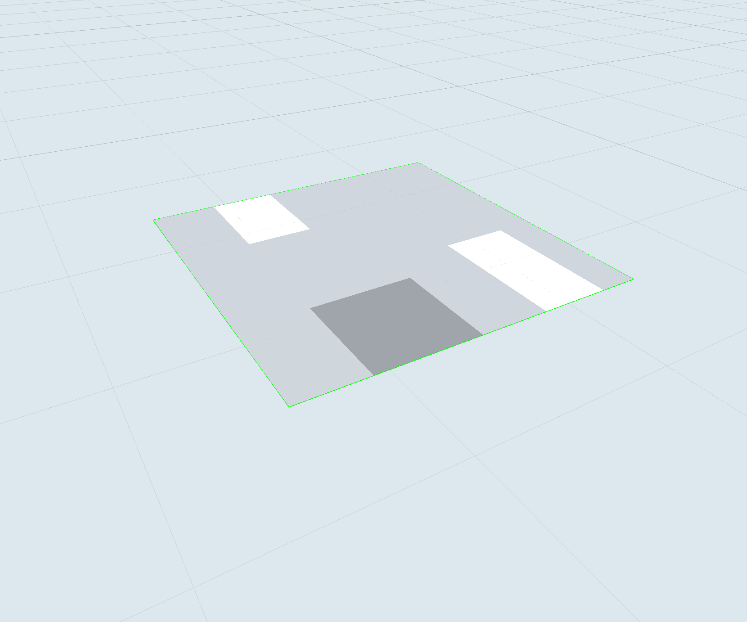
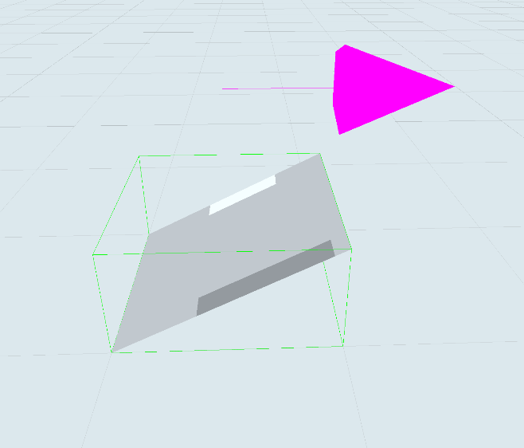
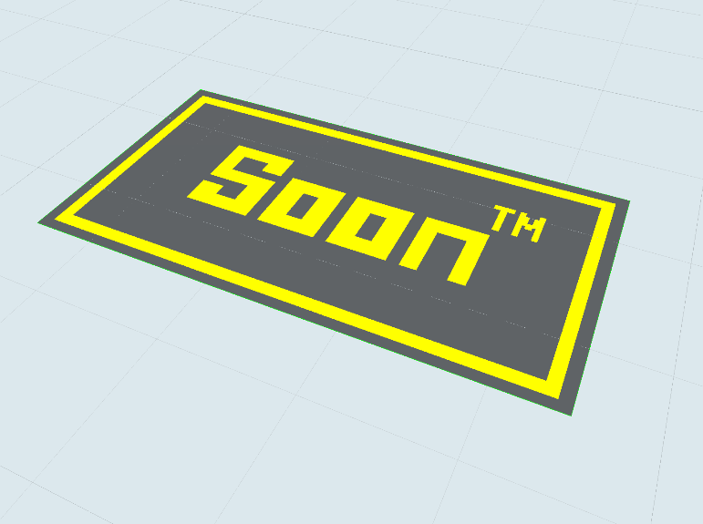
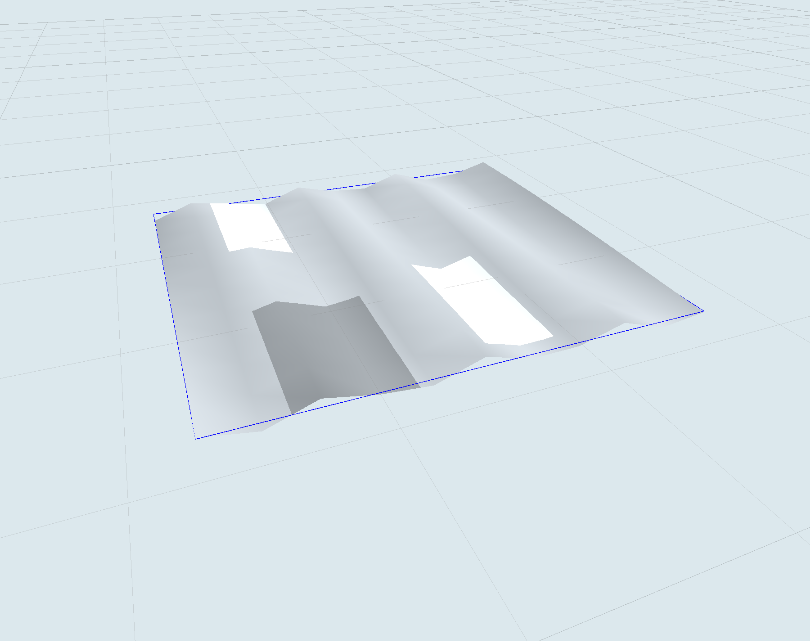
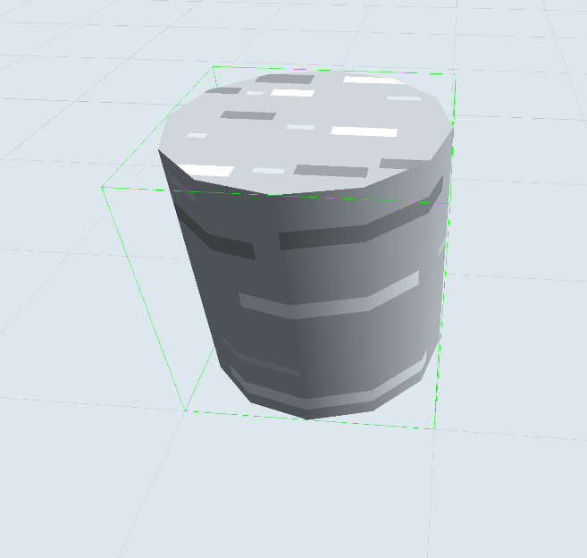
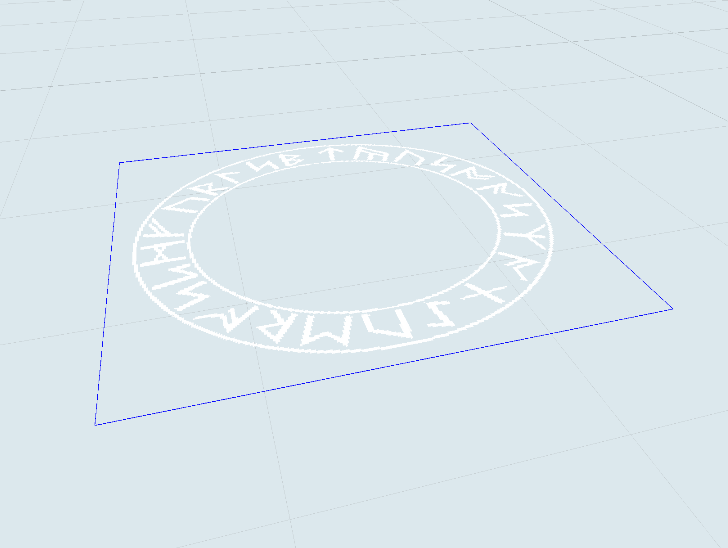
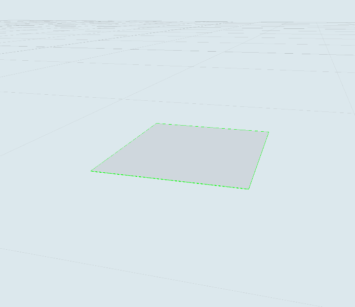
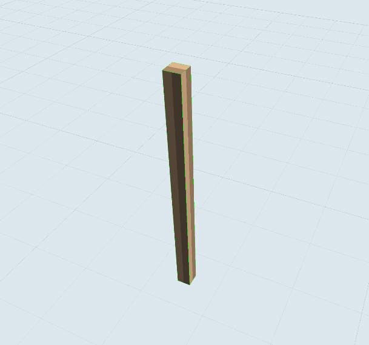

# 2.0.0 Standard objects

## 2.1.0 Basic

### 2.1.1 Cube



#### Visible
Determines if the object is rendered.

`Toggle switch`
`Default: ON`

#### Collidable
Determines if the player can collide with the object.

`Toggle switch`
`Default: ON`

#### Complex Collisions
Allows consideration of rotation and complex model shape in collision calculations. Consider that player movement is different when this property is enabled, and use of this setting is not performant. (See 1.3.4 and 1.3.5 for more information.)

`Toggle switch`
`Default: OFF`

#### Bullet Collisions
Determines if bullets interact with the object. **Collidable** must be enabled for this to have an effect.

`Toggle switch`
`Default: ON`

#### AI Collisions
Determines if AI entities collide with the object. AI is discussed in section 8.

`Toggle switch`
`Default: ON`

#### Penetrable
Determines how much damage reduction this object effects to fired bullets. If set to zero, bullets will not pass through. Knives and crossbow bolts are a different type of projectile and cannot penetrate regardless of this property. Requires bullet collisions.

If a bullet passes through an object with both **Bullet Collisions** and **Penetrable** set to something other than zero and hits another player, the bonus "wallbang" will be applied for a default of 25 extra score.

`Range input (float)`
`Range: 0-1`
`Default: 0`

#### Wall Jumpable
Determines if players can walljump and wallgrind on an object.

`Toggle switch`
`Default: ON`

#### Can Grapple
Determines if grapples can connect with an object. Requires **Bullet Collisions** to be ON. Grapple collisions align with the simple collision box and not complex collisions.

`Toggle switch`
`Default: ON`

#### Can Impulse
Allows impulse weapons to propel players off an object.

`Toggle switch`
`Default: ON`

#### Border
Borders extend 500 units above the cube's top side, and allow bullets, but not players, through. They are useful for preventing unwanted player access to odd places, and are extensively used in rotation (pub) maps. Be mindful that 500 units is not infinite and if you have differently-leveled borders, or other structures nearby, players can make their way over the borders. Borders do not rotate with normal object rotation, and complex collision usage will disable the border altogether.

`Toggle switch`
`Default: OFF`

#### Show On Minimap
Enables minimap visibility.

`Toggle switch`
`Default: ON`

#### Step Sound
Selection for the sound the player makes while walking on the object.

`Dropdown`
`Default: Default`
```
Options:
Default
Wood
Water
Sand
Snow
```
#### Dynamic
Enables dynamic object movement. Dynamic object movement is discussed properly in section 9, dedicated to scripting.

`Toggle switch`
`Default: OFF`

#### Transform > Position
Location of the object in Cartesian coordinates. Positive Y is in the up direction. X and Z location defines the *center* and the Y location defines the bottom.

`Number input (float)`
`Default: 0, 0, 0`

#### Transform > Rotation
Rotation about each Cartesian axis. The Y rotation, for example, allows users to rotate an object laying on the XZ plane (a horizontal surface). Consider 1.3.4 and be mindful of using nonzero rotation with collidable objects.

`Number input (float)`
`Default: 0, 0, 0`

#### Transform > Size
Scale of the object.

`Number input (float)`
`Default: 10, 10, 10`

#### Style > Texture > Type
Type of provided texture used. If a variant is selected, that variant's value will be used for subsequent type selections.

`Dropdown and visual menu`
`Default: Stone`
```
Options (dropdown):
Default
Stone
Dirt
Wood
Grid
Grey
Roof
Flag
Grass
Check
Lines
Brick
Link
Liquid
Grain
Fabric
Tile
Metal
Sand
Snow

Options (visual menu):
None
Stone
Stone (Classic)
Stone (Light)
Stone (Voxel)
Stone (Pebbles)
Stone (Cobble)
Stone (Light Pebbles)
Stone (Light Cobble)
Dirt
Dirt (Classic)
Dirt (Voxel)
Dirt (Modern)
Wood
Wood (Classic)
Wood (Classic Alt)
Wood (Modern)
Grid
Grey
Grey (Template)
Grey (Modern)
Roof
Roof (Classic)
Roof (Tiled)
Flag
Flag (Classic)
Flag (Classic Alt)
Grass
Grass (Voxel)
Grass (Simple)
Grass (Dense)
Check
Lines
Lines (Thick)
Lines (Pipes)
Brick
Brick (Classic)
Brick (Classic Alt)
Brick (Dark)
Brick (Light)
Brick (Simple Red)
Brick (Patterned Red)
Brick (Simple Dark)
Brick (Patterned Dark)
Brick (Simple Light)
Brick (Patterned Light)
Link
Link (Type 2)
Link (Type 3)
Liquid
Liquid (Voxel Water)
Liquid (Lava)
Liquid (Greek Water)
Grain
Grain (Type 2)
Grain (Type 3)
Metal
Metal (Brick)
Sand
Sand (Voxel)
Sand (Greek)
Snow
```
#### Style > Texture > Variant
Variant selection of a given type.

`Dropdown`
`Default: Default`

#### Style > Texture > Asset ID


`String input`
`Default: 0`

#### Style > Texture > Stretch
Makes the entire (diffuse) texture image stretch all the way across each face. Ideal for 
`Toggle switch`
`Default: OFF`

#### Style > Texture > Scale
`Range input (float)`
`Range: 0-10`
`Default: 0`

#### Style > Texture > Force Transparency
Especially with custom textures, allows transparency for transparent pixels. Link textures automatically have this property enabled in the background. 

`Toggle switch`
`Default: OFF`

#### Style > Texture > Rotation
Rotation of the texture in degrees, regardless of whether **Anti-radians** is enabled.

`Range input (float)`
`Range: 0-360`
`Default: 0`

#### Style > Texture > Offset
Allows alignment of the textures along the x and y axes.

`Range input (float)`
`Range: 0-1`
`Default: 0, 0`

#### Style > Texture > Movement > Speed
How fast the texture moves along the object. Negative values reverse direction.

`Range input (float)`
`Range: -20-20`
`Default: 0`

#### Style > Texture > Movement > Axis
Allows users to choose along what axis textures move along.

`Dropdown`
`Default: X`
```
Options:
X
Y
```

#### Style > Texture > Frame Animation > Frame Count


`Range input (float)`
`Range: 0-100`
`Default: 0`

#### Style > Texture > Frame Animation > Frame Speed


`Range input (float)`
`Range: 0-10`
`Default: 0`

#### Style > Texture > Encoding

`Dropdown`
`Default: Default`
```
Options:
Default
sRGBEncoding
LinearEncoding
```
#### Style > Texture > Color
Base/diffuse color.

`Color input (hex)`
`Default: #FFFFFF`

#### Style > Texture > Emissive
Allows the object to self-illuminate.

`Color input (hex)`
`Default: #000000`

#### Style > Texture > Opacity
Lowering this property allows translucence.

`Range input (float)`
`Range: 0-1`
`Default: 1`

#### Style > Texture > Shading
Enables shading. Disable if a flat look is preferred.

`Toggle switch`
`Default: ON`

#### Style > Texture > Fog
Disabling allows an object to show through fog setting. Useful for background deco and luminescent objects. 

`Toggle switch`
`Default: ON`

#### Style > Texture > Render Side
Determines whether the side rendered is the outside (front/default), inside (back), or both (double).

`Dropdown`
`Default: Game Default`
```
Options:
Game Default
Front
Back
Double
```
#### Technical & Logic > Destructible
Allows triggers to destroy this object. Disables some optimization, so using too many objects with this property enabled may be detrimental to performance.

`Toggle switch`
`Default: OFF`

#### Technical & Logic > Start Destroyed
Does not spawn the object at the beginning of a game.

`Toggle switch`
`Default: OFF`

#### Technical & Logic > Spawn Chance
Pair with **Destructible** and **Start Destroyed** to give objects a certain chance to spawn. As with other properties, 0% chance is actually 100%.

`Range input (float)`
`Range: 0-100`
`Default: 0`

#### Technical & Logic > Health
Once this amount of damage is incurred, the object will be destroyed. This is useful for interactive barriers and spleef-type maps.

`Range input (float)`
`Range: 0-50000`
`Default: 0`

#### Technical & Logic > Respawn > Timer (s)
After destroyed, will be recreated according to this time.

`Range input (float)`
`Range: 0-3600`
`Default: 0`

#### Technical & Logic > Respawn > Random
Random respawn time, very small range (under 10 seconds, exact range unknown).

`Toggle switch`
`Default: OFF`

#### Technical & Logic > Interface > ID
Interface ID is used to identify dynamic objects and targets for trigger actions.

`Range input (float)`
`Range: 0-2000`
`Default: 0`'

#### Render Faces
Allows specification of which faces are rendered in game. More easily modified by **Face Selection Mode** given the ambiguity of the directions. Changing the render faces is mostly used for optimization.

`Toggle switch`
`Default: ON`
```
Options:
Right (+Y)
Left (-Y)
Top (+Y)
Bottom (-Y)
Back (+Z)
Front (-Z)
```
### 2.1.2 Ladder


#### Visible
Determines if the object is rendered.

`Toggle switch`
`Default: ON`

#### Collidable
Determines if the player can collide with the object.

`Toggle switch`
`Default: ON`

#### Direction
Determines what direction the front of the ladder faces.

`Range input (float)`
`Range: 0-3`
`Default: 0`

```
0 (+X)
1 (+Z)
2 (-X)
3 (-Z)
```

#### Step Sound
Selection for the sound the player makes while walking on the object.

`Dropdown`
`Default: Default`
```
Options:
Default
Wood
Water
Sand
Snow
```

#### Transform > Position
Location of the object in Cartesian coordinates.

`Number input (float)`
`Default: 0, 0, 0`

#### Transform > Rotation
Rotation about each Cartesian axis.

`Number input (float)`
`Default: 0, 0, 0`

#### Transform > Size
Scale of the object.

`Number input (float)`
`Default: 2, 10, 4`

#### Style > Texture > Type
Type of provided texture used.

`Dropdown and visual menu`
`Default: Wood`
```

Options (dropdown):
Default
Stone
Dirt
Wood
Grid
Grey
Roof
Flag
Grass
Check
Lines
Brick
Link
Liquid
Grain
Fabric
Tile
Metal
Sand
Snow
```

#### Style > Texture > Variant
Variant selection of a given type.

`Dropdown`
`Default: Default`
```

Options:
Default
Classic
Classic Alt
Modern
```

#### Style > Texture > Asset ID


`String input`
`Default: 0`

#### Style > Texture > Stretch


`Toggle switch`
`Default: OFF`

#### Style > Texture > Scale


`Range input (float)`
`Range: 0-10`
`Default: 0`

#### Style > Texture > Force Transparency


`Toggle switch`
`Default: OFF`

#### Style > Texture > Rotation


`Range input (float)`
`Range: 0-360`
`Default: 0`

#### Style > Texture > Offset


`Range input (float)`
`Range: 0-1`
`Default: 0, 0`

#### Style > Texture > Encoding


`Dropdown`
`Default: Default`
```

Options:
Default
sRGBEncoding
LinearEncoding

```

#### Style > Texture > Color
Base/diffuse color.

`Color input (hex)`
`Default: #FFFFFF`

#### Style > Texture > Emissive
Allows the object to self-illuminate.

`Color input (hex)`
`Default: #000000`

#### Style > Texture > Opacity
Lowering this property allows translucence.

`Range input (float)`
`Range: 0-1`
`Default: 1`

#### Style > Texture > Shading
Enables shading.

`Toggle switch`
`Default: ON`
### 2.1.3 Plane

### 2.1.4 Ramp

### 2.1.5 Billboard

### 2.1.6 Sphere


### 2.1.7 Liquid


### 2.1.8 Cylinder

One of the most versatile object types, visually. With cylinders, mapmakers can create archways, robes, conic roofs, 
### 2.1.9 Rune

### 2.1.10 Sprite

### 2.1.11 Rope Ladder


## 2.2.0 Models

### 2.2.1 Crate
### 2.2.2 Barrel
### 2.2.3 Vehicle
### 2.2.4 Stack
### 2.2.5 Tree
### 2.2.6 Cone
### 2.2.7 Container
### 2.2.8 Grass
### 2.2.9 Containerr
### 2.2.10 Acidbarrel
### 2.2.11 Door
### 2.2.12 Window
### 2.2.13 Teddy
### 2.2.14 Cardb
### 2.2.15 Pallet
### 2.2.16 Police
### 2.2.17 Cage
### 2.2.18 Ebarrel
### 2.2.19 Showcase
### 2.2.20 Ghost
### 2.2.21 Pumpkin
### 2.2.22 Skeleton
### 2.2.23 Knight
### 2.2.24 Gift
### 2.2.25 Christmastree
### 2.2.26 Cane
### 2.2.27 Tiles
### 2.2.28 Clouds
### 2.2.29 Dumpster
### 2.2.30 Lamp
### 2.2.31 Water Tower
### 2.2.32 Ac Unit
### 2.2.33 Sheet Metal
### 2.2.34 Antenna
### 2.2.35 Satellite Dish
### 2.2.36 Weaponbox
### 2.2.37 Scrapcrate

## 2.3.0 Tools

### 2.3.1 Camera Position
### 2.3.2 Particles
### 2.3.3 Flag
### 2.3.4 Gate
### 2.3.5 Weapon Pickup
### 2.3.6 Trigger

### 2.3.7 Sign
### 2.3.8 Deposit Box
### 2.3.9 Camera
### 2.3.10 Sound Emitter
### 2.3.11 Bot Path Node
### 2.3.12 Boost Pad
### 2.3.13 Ai Spawner
### 2.3.14 Path Node
### 2.3.15 Prize Wheel
### 2.3.16 Leaderboard
### 2.3.17 Server Node
### 2.3.18 Spray
### 2.3.19 Mystery Box
### 2.3.20 Perk Machine
### 2.3.21 Ai Redirection
### 2.3.22 Krum Machine
### 2.3.23 Map Anchor

## 2.4.0 Lights

### 2.4.1 Light Cone
### 2.4.2 Point Light
### 2.4.3 Light Bar
### 2.4.4 Directional Light
### 2.4.5 Rectarea Light
### 2.4.6 Spot Light

## 2.5.0 Zones

### 2.5.1 Spawn Point
### 2.5.2 Score Zone
### 2.5.3 Death Zone
### 2.5.4 Objective
### 2.5.5 Check Point
### 2.5.6 Teleporter
### 2.5.7 Premium Zone
### 2.5.8 Verified Zone
### 2.5.9 Bomb Site
### 2.5.10 Team Zone
### 2.5.11 Kr Zone
### 2.5.12 Popup Zone
### 2.5.13 Pvp Zone
### 2.5.14 Partner Zone
### 2.5.15 Domination Zone
### 2.5.16 Environment Zone
### 2.5.17 Kpd Zone
